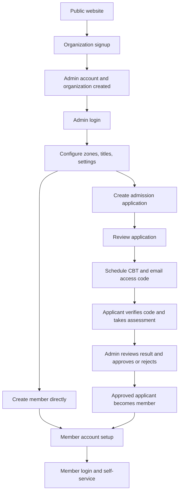

# Product Readiness And Workflow Audit

**Review date:** 2026-10-05  
**Review type:** Source/schema review. The application was not run against a live database as part of this review.

## Executive Summary

Associa8 is intended to be a multi-organization membership platform with admin operations, applicant admissions and assessments, and a member self-service portal. It has a broad PHP UI, a substantial MySQL schema, and several working server-side flows. It is still a prototype: important controls are presentation-only, some modules have no write path, and organization isolation and authorization are not consistently enforced.

**Readiness estimate:** roughly 55-60% of a production MVP, as a qualitative estimate rather than a task-count. The visual/demo experience is further along than the safe, fully operable product. It should not handle real organizations or personal data until the P0 items below are addressed and verified.

The route names and schema described here reflect the checked-in source at the review date. “Implemented” means code exists for the path; it does not mean runtime testing has passed.

## Intended Product

One organization signs up, configures its own membership structure and settings, manages members and applicants, and gives each member a protected portal account. Admin staff operate within role and organization boundaries. Applicants move through review and optional CBT assessment before approval into membership. Members can inspect and maintain their own profile and use organization-scoped services.

## End-to-End Product Flow

The diagram is the target journey, not a claim that every edge is complete. Direct member creation currently does not set a password; approval generates a temporary password. Several member services are read-only or have inert action controls.

## Workflow Status

### 1. Public website and organization acquisition

**Present:** `index.php`, `about.php`, `pricing.php`, and `contact.php` provide public pages. The main `signup.php` form posts to `proc-signup.php`.

**Signup path:** the handler checks password confirmation and existing organization email, admin email, and username before writing; hashes the password; inserts the organization; captures its ID; inserts the login account; captures its ID; inserts the admin profile linked by `acc_id`; and commits the transaction. This is a meaningful end-to-end foundation.

**Remaining:** the OTP field is stored but there is no demonstrated OTP verification or email verification; no welcome/onboarding flow or subscription billing is present. The separate `admin/signup.php` form prevents submission in the browser and has no backend. The public contact form posts to `send-mail.php`, which is not present in the repository. Several marketing calls to action and footer links still point to `#`.

### 2. Admin and member authentication

**Admin path:** `admin/index.php` posts credentials to `admin/proc-login.php`. The handler verifies a password hash in `acc-info`, finds the admin profile by `admin-info.acc_id`, and stores user, organization, role, zone, and sub-zone values in the session. The account/profile relationship is represented in the schema by `acc_id`; the earlier README claim that login relied on matching auto-increment IDs was obsolete.

**Member path:** `member-login.php` posts to `proc-member-login.php`; the handler looks up the email, verifies the member password, blocks suspended accounts, sets member/organization/zone session values, regenerates the session ID, and redirects to the member dashboard. `admin/member/inc/auth.php` protects member pages by checking the member session.

**Remaining:** `admin/inc/auth.php` checks only for a logged-in `user_id`; it does not enforce admin role, organization membership, or module permissions. `admin/user-controls.php` and `admin/process-user.php` create users in the separate `users` table, but the login handler authenticates from `acc-info`; those created users are therefore not integrated into the login/authorization path. Module permissions are stored but are not consistently enforced. The default password created by `process-user.php` is shared and predictable. No complete password reset/change, MFA, account invitation, or member first-login credential setup is evident. Admin login should also be reviewed for session-ID regeneration and brute-force protections.

`logout.php` clears the session and sends the user to the public homepage. Confirm that admin and member logout entry points both terminate the intended session and land on the correct login page.

### 3. Organization boundary and authorization

**Present:** `org_id` is present with foreign keys on core tables such as organizations, admin accounts/profiles, members, zones, titles, documents, admissions, CBT exams/results, suspensions, and portal settings. Many admin listings and writes apply an organization filter. `subzones` inherit organization through their parent zone; CBT questions inherit it through their exam; several member-owned tables can be scoped through the member relationship.

**Release blocker:** a column or foreign key alone does not enforce tenant isolation. The current schema and routes still have gaps:

- `events` has no organization ID, and the member events page queries the shared events table without a tenant filter. Event attendance and RSVPs depend on the event/member relationship, but no event-management flow currently closes that boundary.
- `portal_settings` has a globally unique `portal_key`; its admin form and handler query/write by key without the signed-in organization, so the schema cannot represent independent settings for each organization as currently indexed.
- `attendance_logs`, `finance_transactions`, event records, messaging, notifications, activity records, member preferences, and member sessions do not all have direct organization IDs. Any tenant scoping for these must be enforced consistently through trusted foreign-key relationships and joins.
- `admin/proc-delete-document.php` looks up and deletes by document ID without checking the session organization. `admin/proc-suspension.php` looks up/updates a member by ID without checking the session organization and inserts a suspension without its `org_id`.
- `admin/proc-add-member.php` assigns the session organization but does not independently verify that the selected zone and title belong to it. A valid zone/sub-zone pairing is not sufficient proof of ownership by the current organization.
- Several identifiers and unique constraints are global rather than organization-scoped: member email/code, application number, and some settings. Decide which must be unique per organization, migrate existing data, and enforce the policy in the database and application.

Before launch, inventory every read, insert, update, delete, download, and background/email action that touches tenant data. Add negative cross-organization tests for each handler, not just each page.

### 4. Admin dashboard and staff accounts

`admin/dashboard.php` is a visual dashboard with hardcoded totals, chart data, activity entries, and links. `admin/user-controls.php` reads the `users` table and `admin/process-user.php` can create a user plus module permission rows.

**Remaining:** dashboard metrics and activity need to be computed from tenant-scoped data. The `users` authentication/permission model must either be fully integrated with organization accounts and the session guard or removed in favor of one coherent identity model. User editing, disabling, password invitation/reset, and effective permission checks need working flows. Admin role checks should be enforced on every protected handler, not merely hidden in the sidebar.

### 5. Membership directory, titles, zones, and suspensions

**Present:** member directory and member add/edit/delete handlers are connected to the database and use organization scoping in several paths. Titles and zones have add/edit/list pages and organization-aware schema; sub-zones are associated through zones. Suspension history is represented in the schema and a handler updates member status transactionally.

**Remaining:** verify each create/edit/delete handler for organization ownership, including the add-member zone/title checks. Member codes are generated globally, while the database uniqueness constraint is also global; decide whether codes should instead be organization-local. Some hierarchy and zone controls/fallback rows are still mockups or have placeholder links. Suspension handling currently lacks tenant checks and does not write the suspension organization ID. Add concurrency-safe code generation and explicit status-transition tests.

### 6. Admissions and applicant lifecycle

**Present:** `admin/add-admission.php` and `admin/proc-add-admission.php` let staff create an application with applicant and guarantor information. The status handler supports pending → under review, then under review/CBT completed → approved or rejected. Status notification helpers and email are used. Approval creates a member record and sends a temporary password.

**Remaining:** there is no public applicant application form in the checked-in route inventory; admission entry is staff-driven. Confirm whether public self-application is required. Make application number uniqueness organization-aware if desired. The approval process needs a secure first-login/password-change path and transactional/email-failure behavior users can recover from. Duplicate-email checks and status changes should be organization-scoped and race-safe.

### 7. CBT assessment

**Present:** admins can create exams/questions, view applicant/result pages, and schedule an exam. The applicant flow requests an email code, sends it with PHPMailer, verifies it, loads the assessment, calculates a score server-side, writes a result, updates admission status, and displays the result.

**Known issues and remaining work:**

- `admin/proc-schedule-cbt.php` validates a requested future `scheduled_at`, but the schema has no schedule field and the handler does not persist that timestamp. The notification/email can therefore claim a schedule that is not recorded. Its email template also references `$expiresSqlValue`, which is not defined in the handler.
- `portal_settings` dates are saved globally, but enforcement of those windows in the applicant endpoints is not evident. Define and test the exact start/end/deadline behavior, including timezone handling.
- Ensure exam/question/result access is always scoped through the assigned organization and exam. Add database constraints against duplicate attempts and tests for concurrent submissions, expired codes, missing questions, invalid answers, and email delivery failure.
- Applicant/result pages include placeholder rows or controls when no data exists; remove demo fallback records from production views.
- Client-side restrictions such as disabling copy/context menus are not assessment security. The server must remain authoritative for timing, attempt count, eligibility, scoring, and result integrity.

### 8. Document management

**Present:** admins can upload documents with organization-wide, zone, or sub-zone visibility; the handler validates the zone hierarchy and writes metadata; the listing applies organization and optional zone scope; deletion removes metadata and the stored file. Members have a database-backed document listing with organization/zone visibility filters.

**Remaining:** `admin/proc-delete-document.php` must verify document ownership before deleting. The member and admin pages link directly to upload paths, so test whether a user can bypass application authorization by opening a file URL directly. Validate file content/MIME, size, and safe storage location, not just the filename extension; prevent script execution in the upload directory; handle failed database writes by removing orphan files. Align `uploaded_by` with the actual admin identity model because the FK targets `users` while admin login uses `acc-info`.

### 9. Member portal and self-service

**Present:** member dashboard, profile, attendance, documents, events, messages, payments, and settings pages are protected by the member session guard. Most pages now query member-specific data. A profile-update processor exists at `admin/member/proc-update-profile.php`; it validates fields, checks a CSRF token, and scopes its update by member and organization.

**Remaining by area:**

- **Directly created members:** `admin/proc-add-member.php` does not set a password, so the new member cannot use the email/password login until a credential setup flow exists.
- **Profile:** the profile page reads member data, but its “Edit Information” button is not connected to a form or the update processor, so profile editing is not currently reachable through that page. Photo upload and account/security controls are also incomplete. Confirm every profile lookup includes the session organization where practical.
- **Attendance:** the member page reads attendance history. The admin `admin/attendance.php` page is static sample content; there is no verified admin capture, editing, or reporting workflow.
- **Documents:** member visibility is queried, but direct-download authorization and zone ownership need verification as noted above.
- **Events:** member listing reads shared events and displays RSVP controls, but “Book a Seat” has no submission handler. There is no complete organization-scoped event creation, capacity enforcement, cancellation, or attendance-recording workflow.
- **Payments:** member payment history reads transaction rows, but “Pay up” is inert. There is no verified admin record-payment handler or payment provider/webhook/reconciliation/receipt flow; `admin/financial.php` is mostly hardcoded demo figures.
- **Messages:** a member can view stored threads/replies, but the reply field has no form/handler and the page always selects the first thread. A staff-side compose/send flow is not established.
- **Notifications:** the dashboard reads notifications, but there is no complete read/unread management or preference delivery flow. Settings switches do not persist preferences.
- **Settings:** displayed values are database-backed in places, but account edits, password change, MFA, session revocation, notification preferences, regional settings, and deactivation buttons are not connected to handlers.

### 10. Portal settings, email, and public contact

`admin/portal-settings.php` and `admin/proc-portal-settings.php` exist and store admission/CBT start/end values. Current key uniqueness and queries make these settings global rather than organization-specific. Verify that every public endpoint actually enforces them.

PHPMailer is present and used in admission/CBT flows. Validate SMTP configuration, sender/domain authentication, bounce handling, retries, and user-visible recovery. `contact.php` references a missing `send-mail.php`; the public contact workflow is currently broken unless a handler exists outside this workspace.

## Data Model Inventory

The SQL dump defines organization/admin/account records; members, titles, zones, and sub-zones; admissions and CBT; documents; suspensions; attendance; events and RSVPs; finance transactions; message threads/replies; notifications; member preferences/sessions; activity logs; and a separate `users`/module-permissions system.

The design has useful foreign keys, but not all tenant-owned records have a direct organization key, not all keys are unique at the intended tenant boundary, and some handlers omit ownership checks despite the organization ID being available. The SQL dump includes development/sample data and should be treated as a local fixture, not a production migration or customer-data source.

## Production Blockers By Priority

### P0: tenant isolation, identity, and secrets

- Define one organization-scoped authorization model and apply it to every protected page and POST handler.
- Fix the cross-tenant document deletion and suspension paths; verify every member/title/zone/document/admission/CBT lookup and mutation against the session organization.
- Add an organization boundary to events/settings and other records, or enforce a carefully constrained parent relationship with tenant-safe joins. Replace globally unique keys where the business rule is per organization.
- Integrate or remove the second `users` login/permission model; enforce roles and module permissions server-side.
- Move database and mail credentials to environment-specific secret storage; rotate credentials that have ever been shared or committed. Remove sample accounts and personal/test data from production imports.
- Protect uploads and sensitive downloads from direct unauthorized access.

### P1: close user journeys

- Add member invitation/first-login and password reset/change flows for both manually created and approved members.
- Decide whether admissions are staff-only or public; build and validate the intended applicant intake path.
- Persist and enforce portal/CBT schedule windows, fix the missing schedule expiry value, and test email-failure recovery.
- Implement event administration, RSVP/capacity/cancellation, attendance capture, staff messaging and member replies, real finance operations/payment provider integration, receipts/reconciliation, and notification preferences as required by the MVP.
- Replace hardcoded dashboard/attendance/finance data and placeholder table rows with real tenant-scoped queries or explicit empty states.
- Repair contact form delivery, remove dead `#` calls to action, and either complete or remove the admin signup shell.

### P2: release quality and operations

- Add repeatable database migrations and a clean production seed strategy; validate schema install from scratch and upgrade from the current dump.
- Add automated tests for auth, tenant isolation, status transitions, CBT scoring/timing, document ownership/download, and all state-changing handlers.
- Add request validation, CSRF tokens on all state-changing forms, output escaping, rate limiting, secure cookie/session settings, and audit logging for sensitive admin actions.
- Set up production error logging without exposing SQL errors or secrets; add backups/restore drills, monitoring, HTTPS, mail deliverability checks, and documented deployment/rollback procedures.
- Check responsive behavior, keyboard/accessibility, empty/error/loading states, pagination, and data export behavior across supported devices.

## Minimum Acceptance Gate

Do not call the MVP production-ready until these can be demonstrated on a clean test database:

1. Create two organizations with independent admins, members, zones, titles, settings, documents, admissions, and events. Attempt cross-organization reads and mutations using guessed IDs; every attempt is denied and logged.
2. Sign up an organization, authenticate its admin, create a member, deliver a secure first-login credential, sign in as that member, update the profile, and log out. Repeat with a member created by approved admission.
3. Exercise admission status transitions, schedule a CBT with a persisted time, send/verify an access code, submit exactly one timed attempt, verify server-calculated results, and handle expiry/retry/email failure.
4. Upload, view, and delete documents through authorized routes; confirm direct URLs cannot expose protected documents and one organization cannot delete another's files.
5. Create an event, RSVP within capacity, reject over-capacity/duplicate bookings, cancel a booking, record attendance, and show only the correct organization's data.
6. Record and reconcile a payment using the selected payment method, prevent duplicate callbacks/transactions, and show the correct member/admin ledger and receipt.
7. Verify that admin role/module permissions are enforced in direct URL and POST requests, not only in navigation.
8. Run automated tests and PHP syntax checks in CI; verify fresh installation, upgrade, backup, and restore procedures.

## Review Boundaries

This document is based on checked-in PHP and SQL inspection. No live database, browser flow, mail server, payment provider, deployment environment, or automated test suite was exercised during the review. Re-check each listed gap as implementation changes; a listed route can be present while its external integration or runtime behavior remains unverified.
