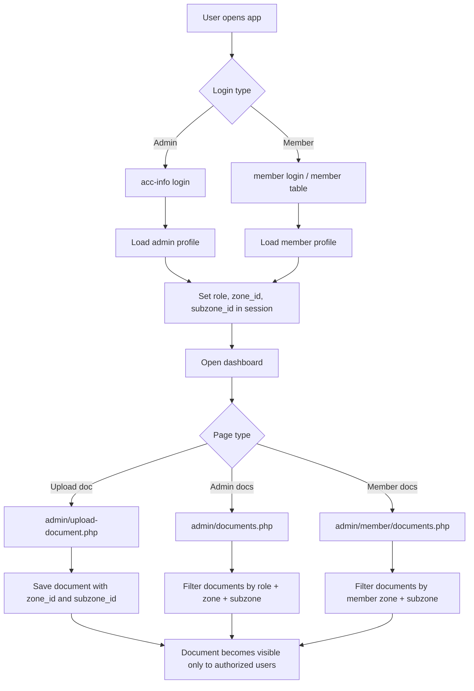

# Associa8 Project Guide

This project is a custom PHP + MySQL membership portal for an organization with separate admin and member experiences. The key business idea is that users are organized by zone and sub-zone, and documents should only be visible to the people who belong to the right scope.

The most important design rule in this app is:

- a document can be organization-wide, zone-scoped, or sub-zone-scoped
- users should only see documents they are permitted to see
- super admins see everything unless a stricter rule is introduced later
- regular admins and members are filtered by the zone/sub-zone they belong to

---

## 1. Project structure

The app is split into public pages and authenticated admin/member sections.

Main folders:

- `admin/` — admin dashboard and admin management pages
- `admin/member/` — member dashboard area
- `inc/` — shared app includes like database connection and navbar/footer
- `css/` — styling
- `js/` — frontend scripts
- `images/` and `videos/` — assets

Key files:

- `admin/proc-login.php` — logs admin users in and sets session values
- `admin/inc/auth.php` — checks whether a user is authenticated
- `admin/documents.php` — admin document list with scoped visibility
- `admin/upload-document.php` — upload form with zone/sub-zone visibility selector
- `admin/proc-upload-document.php` — saves uploaded docs and stores scope
- `admin/member/documents.php` — member-facing document list filtered by zone/sub-zone
- `associa8.sql` — database schema and data dump

---

## 2. The main business model

The project is built around members and zones.

There are three important identity layers:

1. `acc-info`
   - this is the login table used for account access
   - it stores username and password

2. `admin-info`
   - admin profile data
   - includes role, zone_id, subzone_id
   - this is where the admin’s access scope is usually defined

3. `members`
   - member profile data
   - includes zone_id and subzone_id
   - this is the member’s actual organizational scope

The zone/sub-zone relationship is the key link between people and document visibility.

---

## 3. Why zone and sub-zone matter

Documents are not just global files. In this app, they are scoped by location.

Possible visibility states:

- Organization-wide: visible to everyone
- Zone-specific: visible only to that zone
- Sub-zone-specific: visible only to that sub-zone

This means the app should not just show documents to any logged-in user. It must query the database using the user’s zone/sub-zone and compare it with the document row.

---

## 4. Admin and member relationship in the app

### Admin side

The admin dashboard is for internal staff or moderators.

They usually belong to:

- a role like `super_admin`, `admin`, or `manager`
- a `zone_id`
- optionally a `subzone_id`

In the code, the access pattern is:

- `super_admin` sees all documents
- other admin roles only see documents that are:
  - organization-wide, or
  - in the same zone, or
  - in the same sub-zone

This is enforced in the query logic in `admin/documents.php`.

### Member side

The member dashboard is for organization members.

Members are also associated with a `zone_id` and `subzone_id`. Their document list is filtered using the same principle:

- they see organization-wide documents
- they see documents from their own zone
- they see documents from their own sub-zone
- they do not see documents from other zones/sub-zones

This is enforced in `admin/member/documents.php`.

### Super admin logic

The super admin is treated as a full-access user.

The app currently interprets this as:

- role is `super_admin`
- or no zone is assigned to the admin

When that happens, the app avoids scoping and returns everything.

This is a very important concept in the project because it determines whether a user is a true global administrator or a scoped administrator.

---

## 5. The document upload process

The document flow begins in `admin/upload-document.php`.

The form includes:

- document title
- file type
- file upload
- visibility selector
- zone selector
- sub-zone selector

### Visibility selection

The form allows the uploader to choose one of these modes:

1. Organization-wide
2. Specific zone
3. Specific sub-zone

If the uploader chooses a zone or sub-zone, the form populates the dependent dropdowns so the user can select a valid scope.

### Server handling

`admin/proc-upload-document.php` then does the following:

1. checks request method is POST
2. validates title and file type
3. ensures a file was uploaded successfully
4. checks the file extension is allowed
5. stores the file in the upload folder
6. builds a safe file path
7. saves metadata into `documents`
8. includes `zone_id` and `subzone_id` if the doc is scoped

The important database columns are:

- `documents.title`
- `documents.file_path`
- `documents.file_type`
- `documents.file_size`
- `documents.category`
- `documents.uploaded_by`
- `documents.zone_id`
- `documents.subzone_id`

This is what makes the visibility rules possible.

---

## 6. The admin document query logic

The admin documents list is not just "select all from documents". It is context-aware.

In `admin/documents.php`, the app reads the current logged-in admin session:

- `admin_role`
- `admin_zone_id`
- `admin_subzone_id`

Then it decides whether to scope the query.

Pseudo-flow:

```php
if (admin is super_admin) {
    show all documents
} else if (admin has zone) {
    show documents where:
        - org-wide, OR
        - same zone, OR
        - same subzone
} else {
    show only org-wide documents or default safe fallback
}
```

This SQL intent is the heart of the permission model.

---

## 7. The member document query logic

The member document list in `admin/member/documents.php` works in a similar way but checks the member’s own `zone_id` and `subzone_id`.

A member can see:

- documents where `zone_id IS NULL AND subzone_id IS NULL` (organization-wide)
- documents where `zone_id = member zone`
- documents where `subzone_id = member subzone`

They cannot see unrelated zone or sub-zone documents.

This is the app’s core security rule for member access.

---

## 8. Auth and session flow

This part is critical.

### Admin login flow

`admin/proc-login.php` does this:

- finds user by username in `acc-info`
- verifies password
- if valid, stores session values such as:
  - `user_id`
  - `username`
  - `admin_role`
  - `admin_zone_id`
  - `admin_subzone_id`

This is how the dashboard “knows” which scope the logged-in admin has.

### Important security fact

The current app assumes the admin identity can be matched directly to an admin record by the same ID.

This is risky because the app has two different tables:

- `acc-info` for login credentials
- `admin-info` for admin profile and authorization data

If a real admin record does not exist for that same ID, the zone/sub-zone scope will be missing and the app may not filter correctly.

### Member session flow

The member side expects a member session such as `member_id`, but the project does not appear to consistently populate it everywhere.

That is a gap in the auth model that needs to be cleaned up for safe access control.

---

## 9. Recommended auth/session model to tighten the app

The current app works, but it is still partly dependent on assumptions. A cleaner and safer model is:

1. Login should resolve a single user identity from a normalized auth table.
2. The app should then load the actual profile record from the correct table:
   - `admin-info` for admin users
   - `members` for member users
3. The session should store only the final, verified access values:
   - `user_type` = `admin` or `member`
   - `user_id`
   - `role`
   - `zone_id`
   - `subzone_id`
4. Every protected page should read from the same session contract, not direct database assumptions.
5. Optional: include a `session_hash` or `auth_token` if the system grows beyond the current custom PHP flow.

A safer pattern is:

```php
$_SESSION['user_type'] = 'admin';
$_SESSION['user_id'] = 12;
$_SESSION['role'] = 'manager';
$_SESSION['zone_id'] = 2;
$_SESSION['subzone_id'] = 4;
```

This is much clearer than letting each page guess where the user came from or whether the ID matches the right table.

The app should never have a page doing: “if user_id exists, assume admin scope is valid.” That is not enough for a protected multi-role system.

---

## 10. Project flow diagram

The project flows like this:



This is the clean mental model: the user logs in, the session stores the effective scope, and every protected page reads that scope before showing data.

---

## 11. Security checklist for the remaining gaps

These are the main things still worth checking before the app is considered secure enough for real production use:

- [ ] Every protected page must enforce authentication before loading data
- [ ] Session values must be loaded from the correct profile table, not assumed from ID alone
- [ ] `admin_role`, `zone_id`, and `subzone_id` must always be present for admin users
- [ ] `member_id`, `zone_id`, and `subzone_id` must always be present for member users
- [ ] Document visibility must be enforced in SQL, not only in the UI
- [ ] Direct file downloads should be protected by a permission check before serving the file
- [ ] Super admin logic should be explicit and not dependent on missing zone data
- [ ] All document inserts should validate that the selected sub-zone belongs to the selected zone
- [ ] Admin and member sessions should not leak cross-role access by mistake
- [ ] A missing or stale session should redirect to login immediately

---

## 12. Current gaps and what the app still needs

There are a few places where the logic is not yet completely safe or consistent.

### 1. Auth is not fully normalized

`admin/inc/auth.php` only checks whether a user is logged in. It does not automatically populate the full access profile from the database.

This means the app relies on session values being set reliably somewhere else.

### 2. Admin login assumes same ID across tables

`admin/proc-login.php` reads from `admin-info` using the same ID as `acc-info`.

That is only safe if those IDs are guaranteed to match. If not, a user can get a session without a valid zone scope.

### 3. Member login/session is not fully consistent

The member pages expect `member_id` and member-specific data, but the actual login process is not always clearly mapping one login record to one member record.

### 4. File download protection is still a frontier

Right now the app protects access in the list pages, but a direct URL to a document file could still be accessed if someone knows the path.

A stronger fix is to add a secure document view endpoint that checks identity + zone + sub-zone before serving the file.

---

## 13. The correct mental model for this project

If you want to understand the app properly, think of it this way:

- the system is not about documents alone
- it is about access boundaries
- those boundaries are defined by location: zone and sub-zone
- everything is filtered by that scope
- the dashboard is just the place the user sees the allowed data

The real connection is:

- person -> zone/sub-zone -> visible documents

That is the central idea.

Admin dashboard and member dashboard are both just views into that same rule set.

The difference is:

- admin dashboard is controlled by admin role and admin scope
- member dashboard is controlled by member zone/sub-zone
- super admin is a global override with full visibility

---

## 14. Recommended next steps

To make the project clean and defensible, the next moves should be:

1. centralize access logic in one helper
   - one function for `canAccessDocument(userType, userZoneId, userSubzoneId, documentZoneId, documentSubzoneId)`

2. make auth session data explicit and consistent
   - store role, zone, subzone in session after login
   - resolve them from the actual profile table, not by assumption

3. secure direct file access
   - do not allow direct path access without permission checks

4. enforce org-wide vs scoped behavior in SQL and in server-side logic
   - do not rely only on UI hiding

5. decide the super admin rule clearly
   - either `role = super_admin` always means full access
   - or no zone assignment means full access only for certain accounts

---

## 15. Summary

The heart of Associa8 is not just file upload. It is permission-aware document access controlled by organization structure.

The real pattern is:

- admin/member identity
- zone and sub-zone assignment
- document scope
- server-side filtering
- safe visibility

Once this is cleanly implemented, the dashboards become predictable and the company can trust that documents are only visible where they should be.

---

This file is meant to explain the project from the perspective of how the code is designed right now, and where the next security and architecture improvements need to happen.
